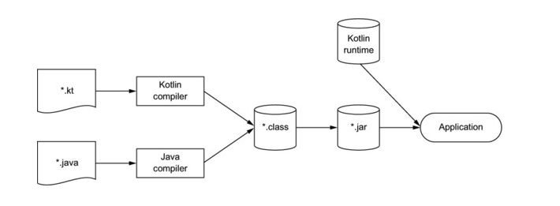
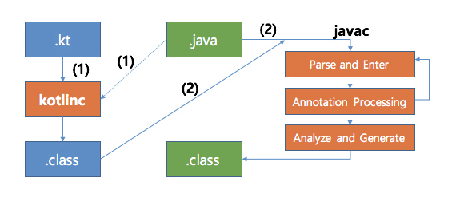

## 1장, 코틀린이란 무엇이며, 왜 필요한가?

* [코틀린의 주요 특성](#코틀린의-주요-특성)
* [코틀린 응용](#코틀린-응용)
* [코틀린의 철학](#코틀린의-철학)

## 코틀린의 주요 특성

### 정적타입 지정언어
정적타입 지정언어 <sup>Statically typed</sup>  - 컴파일시 변수 타입이 결정되는 언어
> 모든 프로그램 구성 요소의 타입을 컴파일 시점에 알수 있고 프로그램 안에서 
객체의 필드나 메서드를 사용할 때마다 컴파일러가 타입을 검증해준다

동적타입 지정언어 <sup>Dynamically typed</sup> - 런타임시 변수의 타입이 결정되는 언어
> 타입과 관계없이 모든 값을 변수에 넣을 수 있고 메서드나 필드 접근에 대한 검증이 
'실행 시점'에 일어나며, 그에 다라 코드가 짧아 지고 데이터 구조를 더 유연하게 생성하고 사용할 수 있다. 
 그러나 이름을 잘못 입력하는 등 실수는 컴파일시 걸러내지 못하고 실행 시점에 오류가 발생한다.

코틀린에서는 모든 변수의 타입을 프로그래머가 직접 명시할 필요가 없다.
대부분의 코틀린 컴파일러가 문맥으로부터 변수타입을 자동으로 유추하기 때문에, 프로그래머는 타입 선언을 생략해도 된다.  
이러한 기능을 **타입 추론** 이라 한다.  
```kotlin
var x = 1 // x를 정수(Int) 값으로 초기화한다. (타입추론)
```

정적타입 지정언어의 장점
* 성능: 실행시점에 어떤 메서드를 호출할지 알아내는 과정이 필요 없음으로 메서드 호출이 더 빠르다.
* 신뢰성: 컴파일러가 프로그램의 정확성을 검증하기 때문에, 실행 시 프로그램이 오류로 중단될 가능성이 적어진다.
* 유지보수성: 코드에서 다루는 객체가 어떤 타입에 속하는지 알 수 있기 때문에 코드를 다룰때 쉽다.
* 도구지원: 정적 타입 지정을 활용하면 더 안전하게 리팩토링 할수 있으며, IDE의 다른 지원기능도 더 잘만들수 있다.

### 함수형 프로그래밍과 객체지향 프로그래밍
📌 함수형 프로그래밍의 핵심개념
* 일급 시민인 함수  : 함수를 일반 값처럼 다룰 수 있다. 함수를 변수에 저장할 수 있고, 함수를 인자로 다른 함수에 전달 할수 있으며, 함수에서 새로운 함수를 만들어서 반환할 수 있다.
* 불변성 : 만들어 지고나면 내부 상태가 절대로 바뀌지 않는 불변 객체를 사용해 프로그램을 작성한다.
* 부수효과<sup>side effect</sup> 없음 : 입력이 같으면 항상 같은 출력을 내놓고 다른 객체의 상태를 변경하지 않는다. 함수 외부나 다른 바깥환경과 상호작용하지 않는 순수함수 를 사용한다.

함수형 스타일로 작성시 장점
* 간결성 : 함수형 코드는 그에 상응하는 명령형 코드에 비해 더 간결하며 우아하다. (순수) 함수를 값처럼 활용할 수 있으면 더 강력한 추상화를 할 수 있고 강력한 추상화를 사용해 코드 중복을 막을 수 있다.
* 다중스레드 사용시 안전 : 불변 데이터 구조를 사용하고 순수 함수를 그 데이터 구조에 적용한다면 다중 스레드 환경에서 같은 데이터를 여러 스레드가 변경할 수 없다. 따라서 복잡한 동기화를 적용하지 않아도 된다.
* 테스트 용이 : 부수 효과가 있는 함수는 그 함수를 실행할 때 필요한 전체 환경을 구성하는 준비 코드가 따로 필요하지만, 순수 함수는 그런 준비 코드 없이 독립적으로 테스트할 수 있다.

## 코틀린 응용
코틀린은 주로 서버와 안드로이드 개발에서 널리 사용되고 있다.
### 코틀린 서버 프로그래밍
### 코틀린 안드로이드 프로그래밍

## 코틀린의 철학
### 실용성
* 언어의 복잡도가 줄어들고 이미 알고 있는 기존 개념을 통해 코틀린을 더 쉽게 배울 수 있다.
* 좋은 언어 만큼이나 편리하 ㄴ개발 환경도 생산성 향상에 필수 적이다. IDE의 코틀린 언어 지원이 중요한 역할을 한다. 흔히 쓰이지만 더 간결한 구조로 바꿀 수 있는 대부분의 코드 패턴을 도구가 자동으로 감지해서 수정하라고 제안한다
### 간결성
* 개발자가 코드를 새로 작성하는 시간보다 기존 코드를 읽는 시간이 더 길다는 사실이 잘 알려져 있다. 코드가 더 간단하고 간결할수록 내용을 파악하기가 더 쉽다
* getter, setter, 생성자 파라미터를 필드에 대입하기 위한 로직 등 자바에 존재하는 여러 가지 번거로운 준비 코드를 코틀린은 묵시적으로 제공하기 때문에 코틀린 소스코드는 그런 준비 코드로 인해 지저분해지는 일이 없다.
### 안정성
* JVM을 사용하면 메모리 안전성을 보장하고, 버퍼 오버플로우를 방지하며, 동적으로 할당한 메모리를 잘못 사용함으로 인해 발생할 수 있는 다양한 문제를 예방할 수 있다.
* 코틀린은 타입 자동 추론을 사용하여 애플리케이션의 타입 안전성을 보장한다. 또한, 실행 시점에 오류를 발생시키는 대신 컴파일 시점 검사를 통해 오류를 더 많이 방지해준다.
* 가장 중요한 내용으로 코틀린은 프로그래밍의 NullPointerException을 없애기 위해노력한다. 코틀린의 타입 시스템은 null이 될 수 없는 값을 추적하며, 실행 시점에 NullPointerException이 발생할 수있는 연상을 사용하는 코드를 금지한다.
  * ```kotlin 
    val s: String? = null // 널이 될 수 있음
    var s2: String = "" // 널이 될 수 없음
    ```
* 코틀린이 방지해주는 다른 예외로는 ClassCastException이 있다.  코틀린에서는 타입 검사와 캐스트가 한 연산자에 의해 이뤄진다.
  * ```kotlin 
    if (value is String) // 타입을 검사한다. 
		    println(value.toUpperCase()) // 해당 타입의 메소드를 사용한다. 
    ```
### 상호운용성
* 자바와 코틀린 소스 파일을 자유롭게 내비게이션 할 수 있다.
* 여러 언어로 이뤄진 프로젝트를 디버깅하고 서로 다른 언어로 작성된 코드를 언어와 관계없이 한 단계씩 실행할 수 있다.
* 자바 메소드를 리팩토링해도 그 메소드와 관련 있는 코틀린 코드까지 제대로 변경된다. 역으로 코틀린 메소드를 리팩토링해도 자바 코드까지 모두 자동으로 변경된다

### Kotlin의 컴파일 과정

* 코틀린 소스코드를 저장할 때는 보통 .kt라는 확장자를 파일에 붙인다. 
* 코틀린 컴파일러는 자바 컴파일러가 자바 소스코드를 컴파일할 때와 마찬가지로 코틀린 소스코드를 분석해서 .class 파일을 만들어낸다. 
* 코틀린 코드를 컴파일한 다음 java 명령으로 그 코드를 실행하는것이다.
> kotlin 파일은 kotlin compiler를 통해 바이트 코드로 변환되는데, 이 코드는 kotlin runtime library에 의존되어 실행한다.  
> kotlin runtime library에는 코틀린 자체 표준 라이브러리, JAVA API를 확장한 내용 등이 있다. 이는 Gradle, maven과 같은 빌드 도구가 Application으로 패키징할 때 알아서 kotlin runtime library를 포함시키게 됨.

### Kotlin의 컴파일 과정

* kotlin 컴파일러가 kotlin코드를 컴파일해 바이트 코드 (.class)를 생성함, 이때 Kotlin코드가 참조하는 java코드도 함께 로딩되어 사용됩니다.
* java 컴파일러가 java코드를 컴파일해 바이트 코드 (.class)를 생성함. 이때 이미 컴파일된 코틀린의 바이트코드 (.class)의 경로를 class path에 추가해 컴파일합니다.

> 만약 기존의 JAVA에서 Lombok을 사용해 만드는 getter를 코틀린에서 호출한다면 컴파일에서 오류가 발생하게 됩니다.  
> (코틀린 컴파일 시점에 getter가 정의되지 않아 오류 발생!) 위의 컴파일 순서를 보면 Lombok이라는 어노테이션 프로세서로 생성되는 코드는 2단계(이미 코틀린은 컴파일된 단계)에서 2번째에 getter가 생성되게 됨.  
> 컴파일 순서가 (코틀린 컴파일) -> (자바 컴파일, 어노테이션 프로세싱)이기 때문에 오류가 발생할 수 밖에 없다.