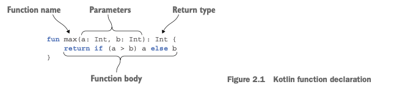
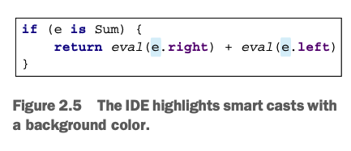

## 2장, 코틀린 기초

* [함수와 변수](#기본요소-함수와-변수)
* [클래스와 프로퍼티](#클래스와-프로퍼티)
* [선택 표현과 처리](#선택-표현과-처리-enum과-when)
* [대상을 이터레이션](#대상을-이터레이션-while과-루프)
* [코틀린의 예외처리](#코틀린의-예외처리)
## 기본요소 함수와 변수
```kotlin
fun main( args: Array<String>) {
    println("Hello World")
}
```
위의 간단한 코드를 통해 알 수 있는 사실
1. 함수를 선언할때 ***fun*** 키워드를 사용한다.
2. 파라미터 이름뒤에 파라미터의 타입을 쓴다.
3. 함수를 최상위 수준에 정의할수 있다.<sup>(*java와 달리 꼭 클래스안에 함수를 넣지않아도됨)</sup>
4. 배열도 일반적인 클래스와 마찬가지다. 코틀린에서는 자바와 달리 배열 처리를 위한 문법이 따로 존재하지 안흔다.
5. System.out.printLn eotls println 이라고 쓴다.
6. 세미콜론(;)을 붙이지 않아도 좋다. (물론 붙여도 된다.)

### 함수
-코틀린 함수 정의

   
위 그림은 코틀린 함수의 기본 구조를 보여준다.
코틀린에서 if는(값을 만들어내지 못하는) '문'이 아니고 결과를 만드는 '식'이다.  

📌문(statement)과 식(expression)의 구분
> 코틀린에서 if는 식이다. 식은 값은 만들어 내며 다른 식의 하위 요소로 계산에 참여할 수 있다.   
> 그러나 '문'은 자신을 둘러싸고 있는 가장 안쪽 블록의 최상위 요소로 존재하며 아무런 값을 만들어 내지 않는다. </br>  
> Java에서는 모든 제어구조가 <b>문</b>인 반면 코틀린에서는 루프를 제외한 대부분의 제어 구조가 식이다.


📌식이 본문인 함수  
위 그림에 나온 함수를 더 간결하게 표현할 수 있다.  
본문이 중괄호로 둘러싸인 함수를 **'블록이 본문인 함수'** 라 (위 그림) 부르고,   
등호와 식으로 이뤄진 함수를 **'식이 본문인 함수'** 라 (아래 코드) 부른다.
```kotlin
fun max(a: Int, b: Int): Int = if(a > b) a else b

fun max(a: Int, b: Int) = if(a > b) a else b -> 반환 타입 생략
```

코틀린에서는 식이 본문인 함수가 자주 쓰인다.
> 💡 위 코드 에서 반환타입을 생략할수 있는 이유는?  
> 코틀린은 정적 타입 지정 언어이므로 컴파일 시점에 모든 식의 타입을 지정 해야하지 않나?  
실제로 모든 식에는 타입이 있으며, 모든 함수는 반환타입이 정해져야 한다.  
> 
> 하지만 식이 본문인 함수의 경우 굳이 사용자가 반환 타입을 적지 않아도 컴파일러가 함수 본문 식을 분석해서 결과 타입을 함수 반환 타입으로 정해준다.  
컴파일러가 타입을 분석해 프로그래머 대신 프로그램 구성요소의 타입을 정해주는 기능으로 **타입 추론**이라 부른다.  

유의할 점: 
* 함수의 반환 타입만 생략 가능하다. 
* 블록이 본문인 함수가 값을 반환한다면 반드시 반환타입 지정과 return문을 사용해 반환값을 명시해야한다.


### 변수
코틀린에서는 키워드로 변수 선언을 시작하는 대신 변수 이름 뒤에 타입을 명시하거나 생략하게 허용한다.
```kotlin
1)  val answer : Int = 42

2)  val answer = 42

3)  val answer: Int
```
* 1): 변수 선언시 타입을 지정후 초기화
* 2): 변수 선언시 타입을 지정하지 않으면 컴파일러가 초기화 식을 분석, 초기화 식의 타입을 변수 타입으로 지정한다.
* 3): 타입 지정, 초기화 식이 없다면 변수에 저장될 값에 대해 아무정보가 없기때문에 타입을 지정해야한다

📌변경 가능한 변수와 변경 불가능한 변수
* **val** (value) : 변경 불가능한 참조를 저장하는 변수 : like java final
* **var** (variable) :  변경 가능한 참조
기본적으로 모든 변수를 val키워드르 사용해 불변변수로 선언하고, 나중에 필요할 때에만 var로 변경해서 사용하라

val변수는 블록을 실행할대 정확히 한 번만 초기화 돼야한다.  
그러나 어떤 블록이 실행 될때 오직 한 초기화 문장만 실행됨을 컴파일러가 확인할 수 있다면 조건에 따라 val값을 여러값으로 초기화 할수 있다.  
```kotlin
val msg: String
if(isFail()){
    msg = "fail"
} else{
    msg = "success"
}
```
val 참조 자체는 불변일 지라도 그 참조가 가리키는 객체의 내부 값은 변경될수 있다.
```kotlin
val languages = arrayListOf("java") //불변 참조를 선언
languages.add("kotlin") //참조가 가리키는 객체 내부 변경
```

### 문자열 템플릿
아래 코드는 name이라는 변수를 선어ㄴ하고 , 그다음 줄에 있는 문자열 리터럴 안에서 변수를 사용했다.
```kotlin
fun main (args: Array<String>){
    val name = if (args.size >0) args[0] else "Kotlin"
    println("Hello, $name!")
    
    //복잡한 식도 변수로 사용할 수 있다.
    println("Hello, ${if (args.size >0) args[0] else "Kotlin"}")
}
```
* ${name} 처럼 중괄호로 변수명을 감싸는 습관을 들이면 더 좋다.

## 클래스와 프로퍼티
```Java
/* Java */
public class Person {
    private final String name;
    
    public Person(String name){
        this.name = name;
    }
    
    public String getName(){
        return name;
    }
}

/* Kotlin*/
class Person(val name: String)

```
### 프로퍼티
클래스라는 개념의 목적은 데이터를 캡슐화 하고, 캡슐화 한 데이터를 다루는 코드를 한 주체 아래 가두는 것이다.  
자바에서는 데이터를 필드에 저장하며, 필드의 가시성은 private하다.  
클래스는 자신을 사용하는 클라이언트가 그 데이터에 접근하는 통로로 쓸 수 있는 **접근자 메서드**를 제공한다.  

자바에서는 필드와 접근자를 한데 묶어 **프로퍼티**<sup>property</sup>라 부르며, 이개념을 활용한 프레임워크가 많다.  
코틀린은 프로퍼티를 언어 기본 기능으로 제공하며, 코틀린 프로퍼티는 자바의 필드와 접근자 메서드를 완전히 대신한다.  

```kotlin
class Person {
    val name: String, //읽기 전용 프로퍼티로 private, getter를 생성
    var isMarried: Boolean // 쓸수 있는 프로퍼티로, private, getter, setter 생성
}
```

### 커스텀 접근자
코틀린은 기본적으로 프로퍼티에 대한 접근자를 자동으로 생성하지만, 필요에 따라 이를 커스터마이징할 수 있다.  
커스텀 접근자를 정의할 때에는 get() 및 set() 키워드를 사용한다.
```kotlin
class Rectangle(var width: Int, var height: Int) {
    var area: Int
        get() = width * height // 커스텀 getter
        set(value) {
            // 커스텀 setter
            if (value >= 0) {
                width = value
                height = value
            }
        }
}
```
### 코틀린 소스구조 : 디렉터리와 패키지

## 선택 표현과 처리: enum과 when
when은 자바의 switch를 대치하되 훨씬 더 강려가며, 앞으로 더 자주 사용할 프로그래밍요소이다.

```kotlin
enum class Color {
    RED, ORANGE, GREEN
}
```

코틀린에서 enum은 소프트 키워드라 부른다. enum은 class 앞에 있을때는 특별한 의미를 지니지만 다른곳에서는 이름에 사용할수 있다.  
반면 class는 키워드다. 따라서 class라는 이름을 사용할수 없으므로 클래스를 표현하는 변수를 저의할때는 clazz ..같은 이름을 사용해야한다.
소프트 키워드란? 특별한 문맥에서민 키워드로 간주되고, 그런 문맥이 아닌경우 일반적인 식별자로 쓸 수 있다.

```kotlin
//프로퍼티와 메서드가 있는 enum클래스 선언하기
enum class Color (
    val r: Int, val g: Int, val b: Int <- 상수의 프로퍼티를 정의
) {
    RED(255,0,0), GREEN(0,255,0), <-  각 상수를 생성할때 그에 대한 프로퍼티 값 지정
    BLUE(0,0,255);  <- enum 클래스안에 메서드를 정의하는경우 반드시 (;)를 넣어야한다. 
    
    fun rgb() = (r * 256 +g) * 256 +b 
}
```

**when 표현식**은 주어진 조건에 따라 다양한 동작을 선택합니다. 각 조건은 화살표(->)를 사용하여 해당 조건이 일치할 때 수행할 동작을 정의한다.
```kotlin
fun main() {
    val x = 5

    when (x) {
        1 -> println("x is 1")
        2 -> println("x is 2")
        3, 4 -> println("x is either 3 or 4")
        in 5..10 -> println("x is between 5 and 10")
        else -> println("x is something else")
    }
}

--> 2x is between 5 and 10
```
* java와 달리 break를 넣지 않아도 된다.
* 한 분기 안에서 여러 값을 매치 패턴으로 사용할 수 있다. 그럴경우 ,로 분리한다.

```kotlin
// 2.14 enum 상수 값을 import enum 클래스 수식자 없이 enum 사용하기
fun getWarmth(color: Color) = when(color){
    RED, ORANGE, YELLO -> "warm"
    GREEN -> "neutral"
    BLUE -> "cold"
}

// 2.15 when의 분기 조건에 여러 다른 객체 사용하기
fun mix(c1: Color, c2: Color) =
    when (setOf(c1, c2)){  //setOf : Kotlin에서 고유한 요소로 이뤄진 불변의 새로운 Set을 만드는 함수
        setOf(RED, YELLO) -> ORANGE
        else -> throw Exception("Dirty color")
    }

//2.16 인자가 없는 when
fun mixOptimized(c1: Color, c2: Color) =
    when {
        (c1 ==RED && c2 ==YELLO) || (c1 ==YELLO && c2 == RED) -> ORANGE
        (c1 ==BLUE && c2 ==YELLO) || (c1 ==YELLO && c2 == BLUE) -> GREEN
        else -> throw Exception("Dirty color")
    }
-> when에 아무 인자도 없으려면 각 분기의 조건이 boolean 결과를 계산하는 식이여야한다.
```

**스마트캐스트** : 타입검사와 타입 캐스트를 조합    
클래스가 구현하는 인터페이스를 지정하기 위해서 콜론(:) 뒤에 인터페이스 이름을 사용한다.
```kotlin
interface Expr
class Num(val value: Int) : Expr <- value라는 프로퍼티만 존재하는 단순한 클래스로 Expr인터페이스를 구현
class Sum(vla lef: Expr, val rightL Expr) : Expr <- Expr타입의 객체라면 어떤것이나 Sum 연산의 인자가 될수 있다.
```
####  변수 타입 검사: is
is는 자바의 instanceof와 비슷하다.  
자바에서는 instanceof로 확인한 후에 명시적으로 변수타입을 캐스팅해야한다.  
코틀린에서는 프로그래머 대신 컴파일러가 캐스팅을 해준다.  
> * 어떤 변수가 원하는타입인지 is로 검사
> * 변수를 원하는 타입으로 캐스팅  

*   
* eval 함수에서 e의 타입이 Num인지 검사
* 컴파일러는 e의 타입을 Num으로 해석
* Num의 프로퍼티인 value를 명시적 캐스팅 없이 e.value로 사용할 수 있다.

## 대상을 이터레이션: while과 루프
## 코틀린의 예외처리

